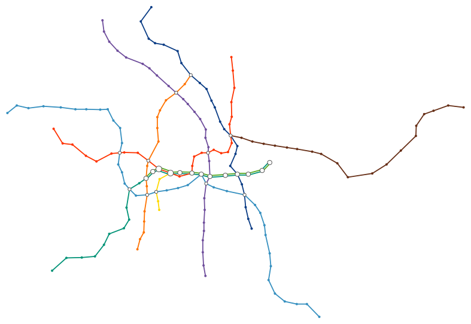
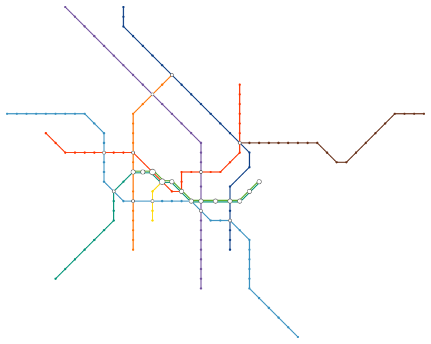
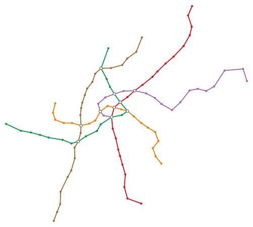
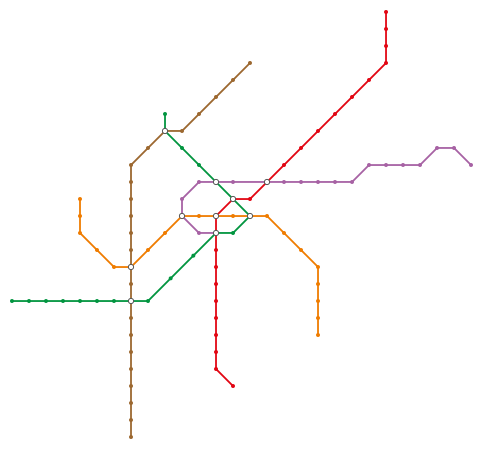

# transit-map

Generate a schematic map (“metro map”) for a given (transit) network graph using a Mixed Integer Programming approach. Part of the [*Generating Transit Maps*](https://github.com/public-transport/generating-transit-maps) project.

**Work in progress, DO NOT USE THIS IN PRODUCTION!** See [todo](#to-do).

[](https://www.npmjs.com/package/transit-map)
[](license)
[](https://gitter.im/juliuste)

## Installation & Requirements

**Sadly, for now, you need a valid copy of the commercial [Gurobi](https://www.gurobi.com/) solver (free academic licenses) in order to run this project. In the near future however, this project will hopefully also support the open `CBC` solver. Stay tuned.**

What you need:

- [`node.js`](http://nodejs.org/) 8.0 or higher installed
- [`gurobi_cl`](https://www.gurobi.com/) 7.5 or higher in your `$PATH`

Then, to install the package (for CLI usage), simply run:

```sh
npm install -g transit-map
```

## Usage

### CLI

You need a JSON graph representation of your transit network that looks like [this example](examples/bvg.input.json) for the Berlin Metro (U-Bahn). You can then generate a transit map for the given graph by running:

```sh
cat graph.json | transit-map > output.svg
```

For further information on several CLI options/params, run:

```sh
transit-map --help
```

### As a library

The module can be used as a JS library, documentation for this will follow.

## Examples

### BVG (Berlin Metro / U-Bahn)

#### Input



#### Output



using [this](examples/bvg.input.json) input graph. Running time ≈40sec.

### Wiener Linien (Vienna Metro / U-Bahn)

#### Input



#### Output



using [this](examples/wien.input.json) input graph. Running time ≈20sec.

## To do

Things I am still working on or someone should work on in the future, roughly in order of perceived importance:

1. Properly document the current optimization algorithm.
2. Add an example for full Berlin network (S-Bahn & U-Bahn), debug pre-processing with this (still fails with this network for some reason).
3. Resolve todo comments in code.
4. Write tests.
5. Improve algorithm: “Smoother” edges, higher distance for parallel lines, implement station labels.
6. Linearize objective function which would allow users to use non-commercial solvers like Cbc.
7. Enable users to provide an old layout of the same network (or parts of it), the newly generated network should then have as few differences as possible to the older one.
8. Further explore heuristical approaches to this problem.
9. Write a paper. 😄

## Contributing

If you found a bug or want to propose a feature, feel free to visit [the issues page](https://github.com/juliuste/transit-map/issues).
